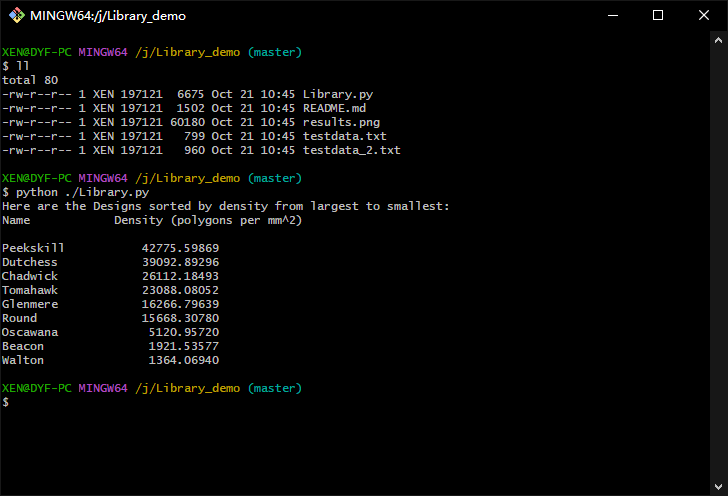

### <b>Library demo</b>
This is a simple programme that implements the following features：

1. Create a class called Design with (at least) the following attributes: lower left x, lower left y, upper right x, upper right y, polygon count, md5sum, area, and density (polygons per mm^2).
2. Create a class called Library that will store all of the instances of the Design class- you can choose how to store it.
3. Create a method for the Library class that will print the names of all designs ordered by density (high to low).
4. Read in the test data, create an instance of design for each row, and store each Design instance into one instance of the Library.
5. Finally, call the Library method that prints the ordered list.

#### <b>Structure of the project</b>
- ./.idea: save PyCharm configuration file.
- Library.py: Python source code.
- testdata.txt: A data file containing data.
- testdata_2.txt: A data file containing error data that is used to test the stability of the program. In a typical application scenario we are trusting the data source. In this programme testdata.txt is used as data source.

#### <b>operating environment</b>
- Windows 10 22H2 x64
- PyCharm 2022 Community Edition 2022.3.2
- Python 3.9
  
To test this application use the following command：

#### <b>Execution results</b>


```shell
git clone https://github.com/SogelleS/Library_demo.git
```
